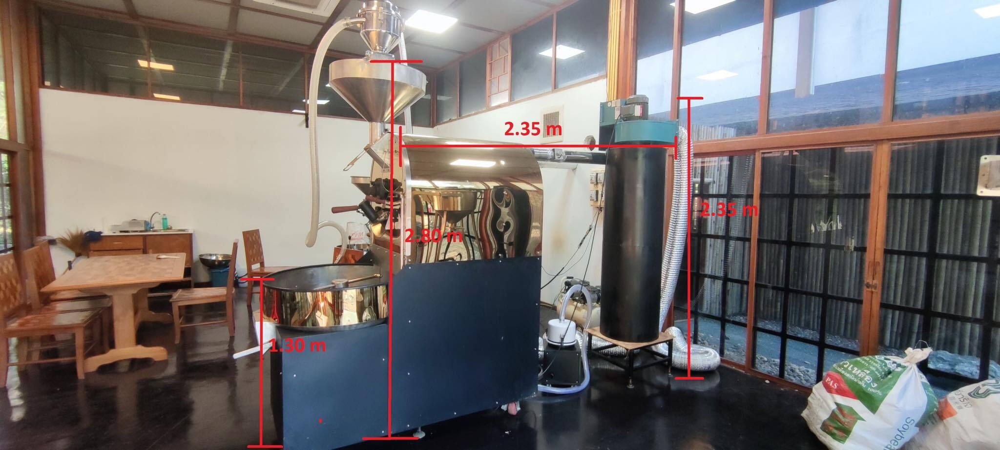

<smaller>*[planb.coffee](https://www.planb.coffee/)*</smaller>
# Støtte kjøp av ny kaffebrenner?

Yindee Coffee/ Rayong Vineyard har ikke som mål å tjene mest mulig penger. I korona-perioden har det blitt trangere økonomisk, men i det siste har omsetningen økt en del.

Det betyr at selve kaffebrenningen tar en del mer tid, men [Jeff og familien](https://yindee.no/index.php/about-yindee-coffee-roasters) ønsker heller mer tid til mennesker og frivillig arbeid i lokalsamfunnet.

Nå i februar/ mars har det dukket opp en mulighet til å kjøpe en brukt og oppusset, større kaffebrenner til en fjerdedel av ny pris. Dersom den viser seg å være et bra alternativ, vil det frigjøre tid til [det gode arbeidet](support-why.md). **Har du lyst til støtte et slikt kjøp?**

Du kan [støtte på flere måter](support-how.md), inkludert å VIPPSe til nr 131085, Plan B Arbeid Thailand. Dersom vi kommer opp i 170 000 Nkr vil dette dekke kaffebrenneren i bildet over.
