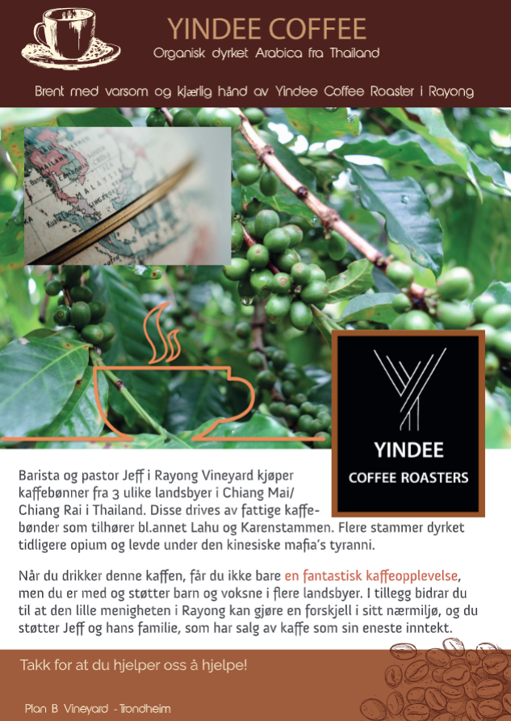

<em><smaller><a href="https://www.planb.coffee">planb.coffee</a></smaller></em>
# Support the good work - why

{: style="float: right; width: 300px; margin: 10px"}

![[EN]](assets/english.webp){: style="width: 25px; height: 14px"}

**You get [quality coffee and tea](https://yindee.no/index.php/garantied-best-quality)**, freshly harvested, [freshly roasted](https://yindee.no/index.php/thailand-coffee/16-the-benefits-of-fresh-roasted-coffee).

**You support coffee and tea farmers** through [direct trade](https://yindee.no/index.php/garantied-best-quality/15-direct-trade-fair-coffee-and-tea), also supporting Thailand's transformation of the northern region, [from drug trade to a coffee growing industry](https://yindee.no/index.php/thailand-coffee).

**You support community work in Rayong**, Thailand. Coffee roaster and pastor Jeff and his family [started Yindee Coffee Roaster and a café in 2012](https://yindee.no/index.php/about-yindee-coffee-roasters), aiming to both support coffee farmers in the north and support local the community in Rayong.

*[How to support?](support-how.md)*

![[NO]](assets/norsk.png){: style="width: 25px; height: 14px"}

## Hvorfor støtte

Støtte til Yindee Coffee/ Rayong Vineyard vil bidra til å støtte fattige i nord, trengende i Rayong, med mer.

---

 *[Hvordan støtte?](support-how.md)*

 <footer></em>(Bilde/ flyer - i hhv <a href="flyer.png">stort format</a> og <a href="flyer.pdf">PDF-format</a>)</em></footer>
